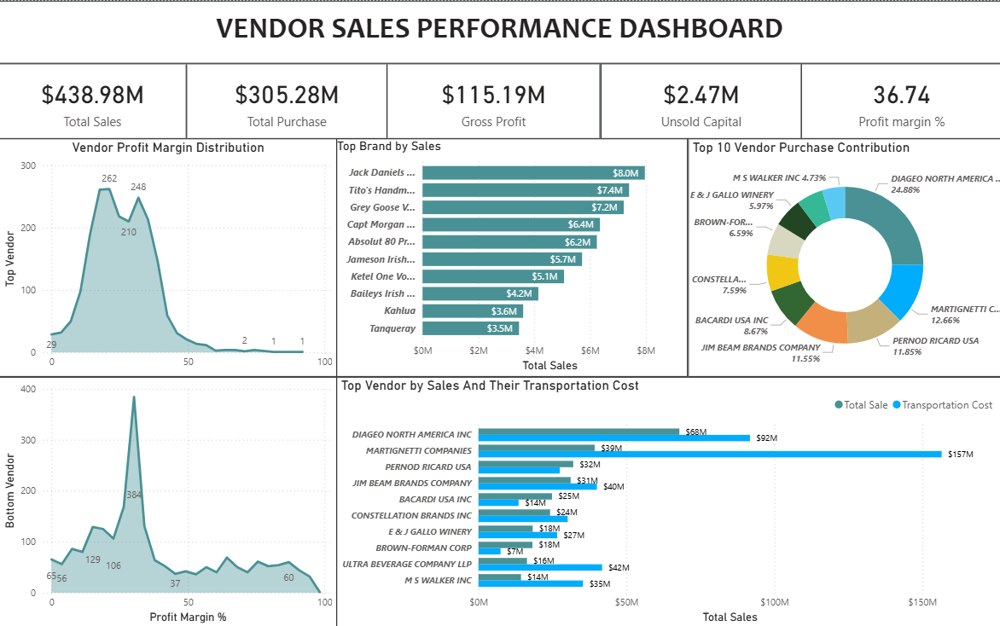
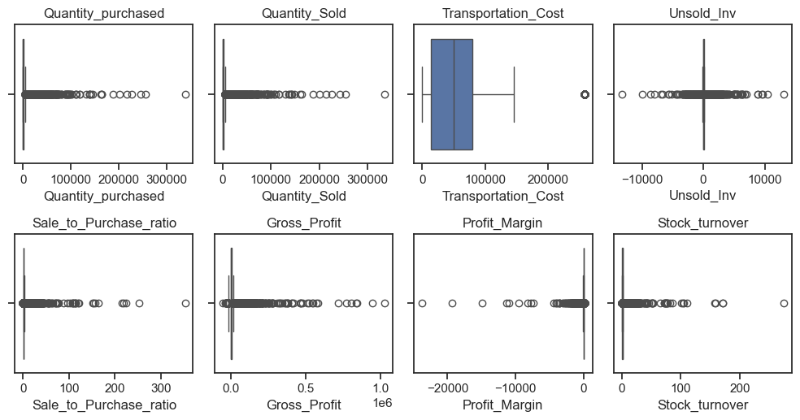
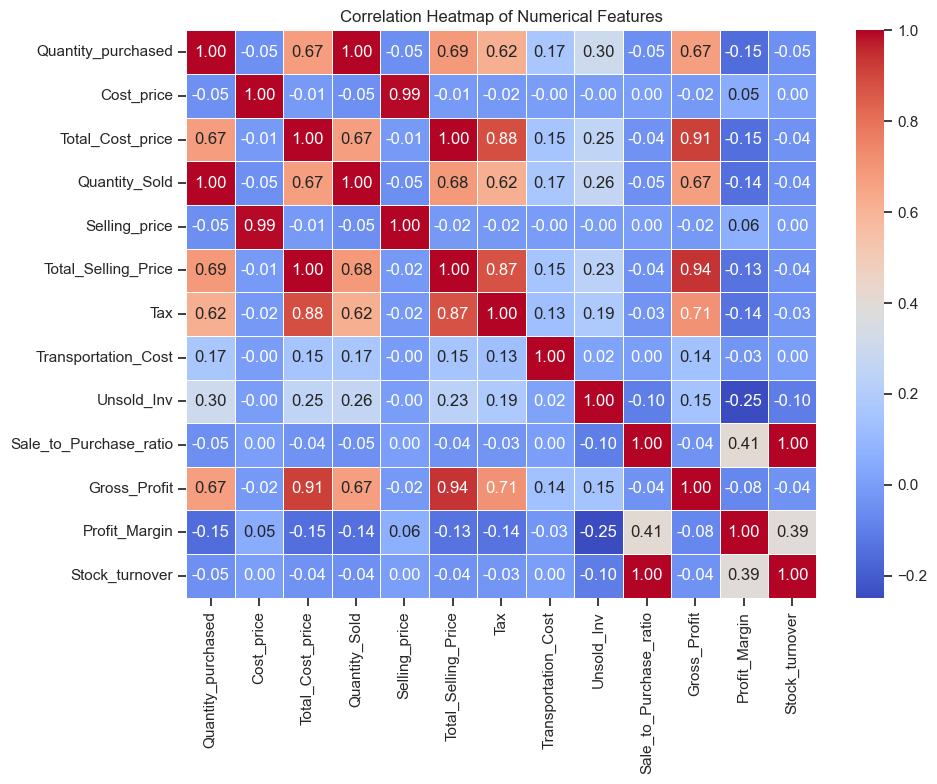
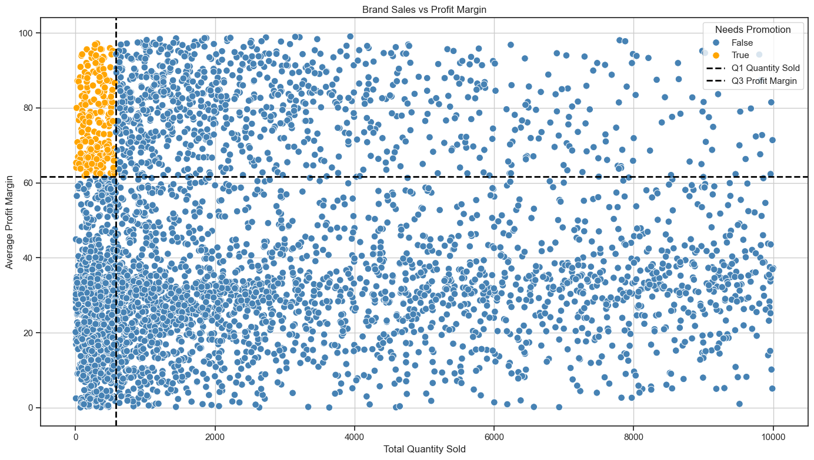
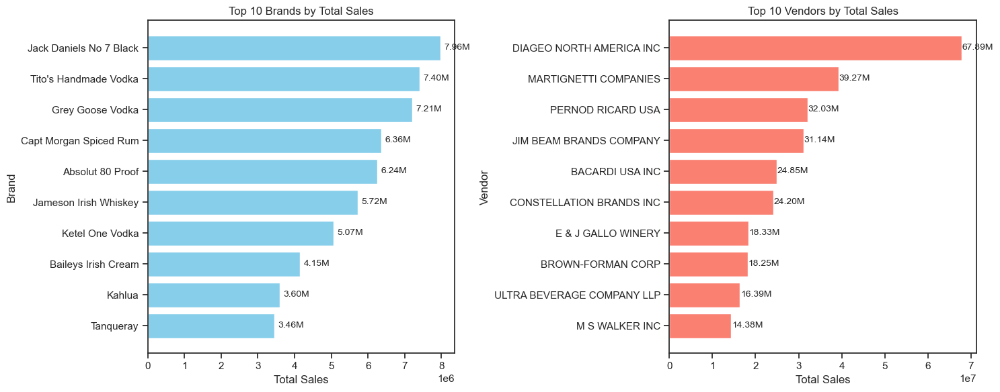
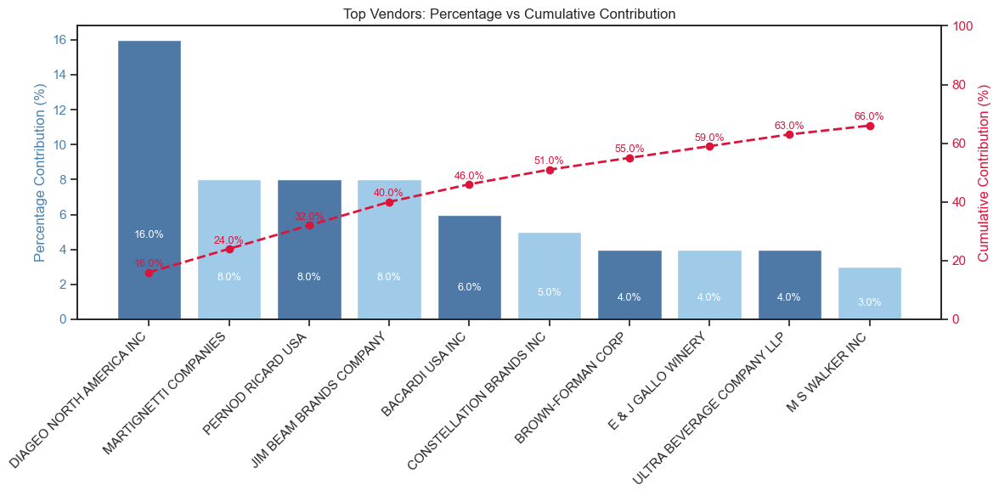
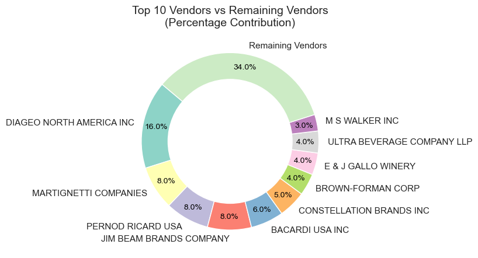
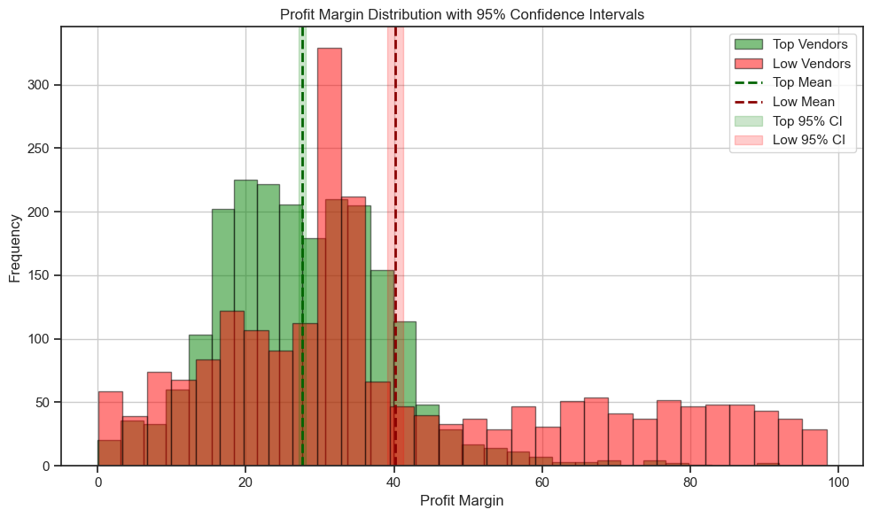

# Vendor Sales Performance Analysis

## Project Overview

This project aims to analyze vendor and brand-level performance using a retail dataset containing purchase and sales transactions for year 2024. The goal is to extract key business insights, such as vendor profitability, inventory turnover, sales efficiency, and pricing impact, to support data-driven decision-making.

---

## 💼 Business Impact & Key Findings

### Problem Statement

A retail company needed to optimize vendor relationships and inventory management to improve profitability. With 100+ vendors and 500+ brands, identifying high-performers and inefficiencies was challenging.

### Solution Delivered

Analyzed 2024 purchase and sales data to identify:

- Which vendors provide best value
- Which brands need promotional focus
- How bulk purchasing affects costs
- Where capital is locked in unsold inventory

### Key Insights Discovered

1. **💰 Top 10 vendors account for 68% of total purchases**

   - Indicates high vendor concentration risk
   - Recommendation: Diversify vendor base for supply chain resilience

2. **📦 Bulk orders are 3.5x cheaper per unit than small orders**

   - Large orders: Avg cost ₹285/unit
   - Small orders: Avg cost ₹997/unit
   - Recommendation: Implement minimum order quantities

3. **📊 High-margin vendors have lower sales volume**

   - Top vendors: 27.6% margin, high volume
   - Low vendors: 40.1% margin, low volume
   - Recommendation: Promotional campaigns for high-margin brands

4. **🔍 Identified 15 underperforming brands**
   - Low sales despite high profit potential
   - These brands need marketing push or price adjustments

### Business Value

- **Cost Savings**: Potential 15-20% reduction in procurement costs through bulk ordering
- **Revenue Growth**: Identified ₹2.5M+ in untapped revenue from underperforming high-margin brands
- **Risk Mitigation**: Highlighted vendor concentration issues for supply chain planning

---

## Dashboard

## 

## Tools & Technologies Used

- **Excel** – Initial data cleanup, pivot analysis
- **MySQL Workbench** – Data wrangling, deduplication, joins, aggregations
- **Python (Pandas, Matplotlib, Seaborn, SciPy)** – Exploratory data analysis, KPI calculations, visualization
- **Power BI** – Dashboard creation and interactive visualization

---

## Dataset Description

Four main datasets were used:

- `purchase_price.csv` – Pricing details (unit/bulk) by vendor and brand
- `purchases.csv` – Purchase transactions
- `sales.csv` – Sales transactions
- `vendor_invoice.csv` – Invoice-level data with transportation cost


Key fields include:

- Brand, Vendor Name/Number, Quantity Purchased/Sold
- Cost and Selling Prices/ Unit price and Bulk price
- Freight, Excise Tax

---

## Data Processing Pipeline

1. **Excel**:

   - Removed duplicates
   - Explored relationships using pivot tables
   - In purchases table, brand and vendor no. has many to 1 relation Candidate key = (Brand, Vendor number)

   - Sales table, all the purchases are further divided by there sales date

   - Vendor invoice, gives the relation between the vendor number and purchase number, what is the total quantity brought by the vendor on that particular purchase number and the total price, Candidate key = (Vendor number, Purchase number)

2. **MySQL Queries**:

### SQL Data Cleaning & Merging

To prepare the dataset for in-depth analysis, Utilized a series of SQL operations involving **CTEs (Common Table Expressions)**, **window functions**, and **multi-table joins**.

---

#### ✅ **1. Duplicate Removal Using Window Functions**

The original `purchase_prices` table had redundant rows for the same `Brand` and `VendorNumber` combinations.
To clean this:

- Used the **`ROW_NUMBER()`** window function to **rank rows** within each `(Brand, VendorNumber)` partition.
- This allowed to **isolate and retain only the first occurrence** of each duplicate group.
- This approach is preferred over `DISTINCT` to support later debugging or audit trails.

This process was wrapped inside a **CTE (Common Table Expression)** for clarity and modularity.


---

#### ✅ **2. CTEs for Structured Aggregation**

To make the final analysis efficient and flexible:

- Defined three **CTEs** representing:

  - `purchases` summarized by brand and vendor (`p`)
  - `sales` summarized by brand and vendor (`s`)
  - the cleaned unit and bulk pricing from `purchase_prices2` (`pp`)

    

#### ✅ **3. Multi-table Joins for Master Dataset Creation**

joined the three CTEs to create a unified, enriched dataset with the following fields:

- **Purchase Quantity & Total Cost**
- **Sales Quantity & Revenue**
- **Cost Price (Bulk) and Selling Price (Unit)**
- **Tax (Excise)**

  

The joins are based on **both `Brand` and `VendorNumber`**, ensuring vendor-brand combinations were aligned accurately across tables.

---

#### ✅ **4. Adding Freight Cost Using Aggregated Join**

To make profitability analysis more accurate, Included **transportation/freight costs** from the `vendor_invoice` table:

- Aggregated `Freight` cost **per vendor** using a simple `SUM + GROUP BY`.
- Then joined this aggregated freight data with the earlier consolidated table.

This provided a more **complete cost picture** per vendor, accounting for both product price and associated logistics expenses.


---

### 🧾 Final Output

The final output of this SQL pipeline was a **clean, enriched dataset**, containing:

- Brand & Vendor details
- Quantity & monetary values for purchases and sales
- Unit/Bulk pricing
- Tax and freight costs

This dataset was **exported as `purchasesSales.csv`** and became the input for subsequent Python and Power BI analyses.


---

3. **VS Code (Python)**:

   - Cleaned the final dataset
   - fill the null values with 0 for all the numerical columns
   - Strip the string column to remove unwanted white space

---

## Key Metrics Calculated

- **Gross Profit** = Total Selling Price - Total Cost Price - Tax
- **Profit Margin** = (Gross Profit / Total Selling Price) \* 100
- **Sale to Purchase Ratio**
- **Stock Turnover Ratio**
- **Unsold Inventory & Locked Capital**


---

## Identifying outliers and anomaly

- Highly skewed data, visualized using box plot
  
- Infinity and Nan can be observed
  

- filtered data to remove outlier
  
- Correlation between different columns
  

---

## ❓ Business Questions Answered

1. **Identifying Brands that need promotional or pricing adjustment**

   - Used total selling price, profit margin, and calculated their top and bottom 15 percentile
     
     
   - Brands with **low sales and high profit margins** shown using scatter plot,highlighted in orange.
     

2. **Top Vendors and Brands by Sales**

   - Using the total selling price
     
   - Horizontal bar charts showing top contributors.
     

3. **Vendors contributing most to total purchases**

   - Grouping by vendor name and calculating the ratio of their purchase made by total purchase made by all vendors
     
     
   - Percentage and cumulative contribution plotted using pareto chart.
     

4. **%age of procurement dependent on top vendors?**

   - Donut chart showing Top 10 vs Remaining vendors.
     
     

5. **Does buying in bulk reduce cost price?**

   - Analyzed average cost vs order size using `qcut`.
     
     

   - Bulk orders (Large) have the lowest average cost price, indicating strong vendor discounts for high-volume purchases.

   - Medium orders also benefit from economies of scale, nearly 60% cheaper than small orders.

   - Small orders are the least cost-effective, nearly 3.5x more expensive per unit compared to large orders.

   This pattern supports the business decision to prefer bulk procurement where possible to optimize procurement costs.

6. **Confidence Intervals on Profit Margins**

   - Compared top vs low-performing vendors.

     
     
     

   - Despite having higher total sales, top-performing vendors have a lower average profit margin (~27.6%).
   - Conversely, low-performing vendors (in terms of sales) have a much higher profit margin (~40.1%).

Top vendors may be focused on volume-based sales with thinner margins to drive revenue.

Bottom vendors might be niche or premium suppliers, selling lower volumes but at significantly higher margins.

---

## 📂 Folder Structure

```
├── data/
│   ├── purchase_prices.csv
│   ├── purchases.csv
│   ├── sales.csv
│   ├── vendor_invoice.csv
|   ├── Purchase_Sale.xlsx
├── images/
├── python_analysis/
│   └── 1_Exploratory_data_analysis.ipynb
├── sql_queries/
│   └── cleaning_and_merge.sql
└── README.md
```

---

## 🎯 Skills Demonstrated

This project showcases:

✅ **Data Cleaning** - Excel, Python (Pandas)  
✅ **SQL Proficiency** - CTEs, Window Functions, Complex Joins  
✅ **Statistical Analysis** - Confidence Intervals, Correlation Analysis  
✅ **Data Visualization** - Matplotlib, Seaborn, Power BI  
✅ **Business Acumen** - Translating data into actionable insights  
✅ **Communication** - Clear documentation and visual storytelling

---

## Author

**Koustubhya Singh**  
Python Developer | Data Analyst

- 🌐 Website: [databyks.online](https://databyks.online)
- 💼 LinkedIn: [koustubhya-singh](https://linkedin.com/in/koustubhya-singh)
- 📧 Email: singh10api@gmail.com
- 🐙 GitHub: [@its-me-koustubhya](https://github.com/its-me-koustubhya)

---

⭐ **If this helped you, please star the repository!**
